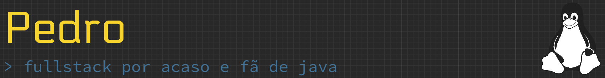

### 🛠️ stacks

| categoria | ferramenta |
| :--- | :--- |
| <code style="color: #fb4934;">front</code> |        |
| <code style="color: #b8bb26;">back</code> |     |
| <code style="color: #83a598;">dados</code> |      |
| <code style="color: #d3869b;">infra</code> |    |
| <code style="color: #fabd2f;">gestão</code> |      |

### 📊 código e rádio

| ⏳ wakatime (semana) | 🎧 rádio (spotify) |
| :---: | :---: |
|  |  |
